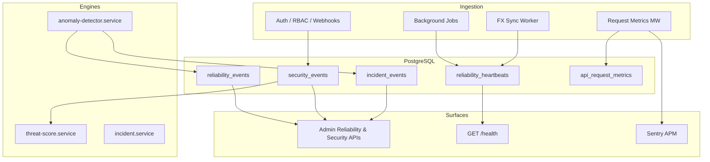

# SABO Reliability & Security Intelligence — Implementation Report

> Completed: 2026-06-14

## Summary

Enterprise-grade observability and security intelligence subsystems were added to SABO as **write-side instrumentation** and **read-only admin APIs**, without modifying ledger, trade settlement, or wallet logic.

---

## Phase Completion

| Phase | Status | Notes |
|-------|--------|-------|
| 1 — Reliability Foundation | ✅ | `reliability_heartbeats`, heartbeat service, job instrumentation |
| 2 — Anomaly Detection | ✅ | FX stale/spike, job failures, txn spikes, API errors/latency |
| 3 — API Monitoring | ✅ | Request metrics middleware + persistence |
| 4 — Security Intelligence | ✅ | `security_events`, auth/RBAC/webhook/OTP instrumentation |
| 5 — Access Control Hardening | ✅ | Permission matrix + `requirePermission()` on admin routes |
| 6 — Deep Health Check | ✅ | `GET /health` returns component diagnostics, 503 on critical failure |
| 7 — Incident Management | ✅ | `incident_events` with auto-create + auto-resolve |
| 8 — Admin Dashboard APIs | ✅ | Reliability + security endpoints |
| 9 — APM Integration | ✅ | Sentry (optional via `SENTRY_DSN`) |
| 10 — Testing | ⚠️ | Build passes; DB migration/tests require running PostgreSQL |

---

## New Database Tables

| Table | Purpose |
|-------|---------|
| `reliability_heartbeats` | Component health snapshots |
| `reliability_events` | Detected anomalies |
| `security_events` | Structured security signals |
| `incident_events` | Auto-managed incidents |
| `api_request_metrics` | Request latency/status persistence |

**Migration:** `src/database/migrations/1775250000000-AddReliabilitySecurityIntelligence.ts`

---

## New API Endpoints

### Reliability (admin + `reliability.view`)

| Method | Path | Description |
|--------|------|-------------|
| GET | `/admin/reliability/summary` | Uptime, component health, FX sync, incidents |
| GET | `/admin/reliability/events` | Anomalies + incidents |
| GET | `/admin/reliability/uptime` | Daily SLA buckets |

### Security (super_admin + `security.view`)

| Method | Path | Description |
|--------|------|-------------|
| GET | `/admin/security/threat-metrics` | Detection rates, severity breakdown |
| GET | `/admin/security/events` | Security event history |
| GET | `/admin/security/audit-extract` | Merged admin logs + security events (JSON/CSV) |
| GET | `/admin/security/permissions` | Permission matrix export |

### Health

| Method | Path | Description |
|--------|------|-------------|
| GET | `/health` | Deep diagnostics (DB, FX freshness, heartbeats) |

---

## Architecture



---

## Modified Files

- `src/app.ts` — request metrics middleware, deep health
- `src/server.ts` — observability init, anomaly + metrics jobs
- `src/config/env.ts` — Sentry env vars
- `src/database/data-source.ts` / `data-source.test.ts` — new entities
- `src/middleware/authMiddleware.ts` — security events
- `src/middleware/adminMiddleware.ts` — unauthorized admin logging
- `src/middleware/rateLimiter.ts` — rate-limit security events
- `src/middleware/errorHandler.ts` — Sentry capture
- `src/jobs/fx-rate-sync.worker.ts` — heartbeats + FX sync tracking
- `src/jobs/pinExpiryJob.ts`, `bidExpiryJob.ts`, `depositExpiryJob.ts` — monitored jobs
- `src/modules/auth/auth.controller.ts` — failed login/OTP events
- `src/modules/deposits/deposits.controller.ts` — webhook security + heartbeats
- `src/modules/admin/admin.routes.ts` — permission matrix + sub-routers
- `tests/all-endpoints.smoke.test.ts` — new endpoint coverage
- `tests/helpers.ts` — `makeSuperAdmin` helper

---

## Deployment Checklist

1. **Run migration on staging/production:**
   ```bash
   npm run migration:run
   ```

2. **Optional environment variables:**
   ```env
   SENTRY_DSN=https://...@sentry.io/...
   SENTRY_TRACES_SAMPLE_RATE=0.1
   FX_STALE_THRESHOLD_MINUTES=30
   FX_SPIKE_THRESHOLD_PCT=5
   API_LATENCY_WARNING_MS=1000
   API_LATENCY_CRITICAL_MS=3000
   ```

3. **Verify deep health:**
   ```bash
   curl https://your-api/health
   ```

4. **Verify admin APIs** (super_admin token for `/admin/security/*`):
   ```bash
   curl -H "Authorization: Bearer $TOKEN" https://your-api/admin/reliability/summary
   ```

5. **Confirm no regression:** run full smoke suite against test DB:
   ```bash
   npm run migration:run:test
   npm test
   ```

6. **Monitor Render logs** for `[anomalyDetectionJob]`, `[fx-rate-sync]`, `[sentry]` startup messages.

---

## Test Report

| Check | Result |
|-------|--------|
| TypeScript build (`npm run build`) | ✅ Pass |
| Migration file created | ✅ |
| Smoke tests updated | ✅ |
| Integration tests executed | ⚠️ Skipped — PostgreSQL test DB not available (`ECONNREFUSED`) |

---

## Backward Compatibility

- All existing business endpoints unchanged
- Admin routes retain same paths; permissions now enforced (admin role retains all operational permissions except `security.view` and `company_rates.manage` which require super_admin)
- `/health` response shape changed ( richer diagnostics ) — clients checking only HTTP 200 remain compatible
